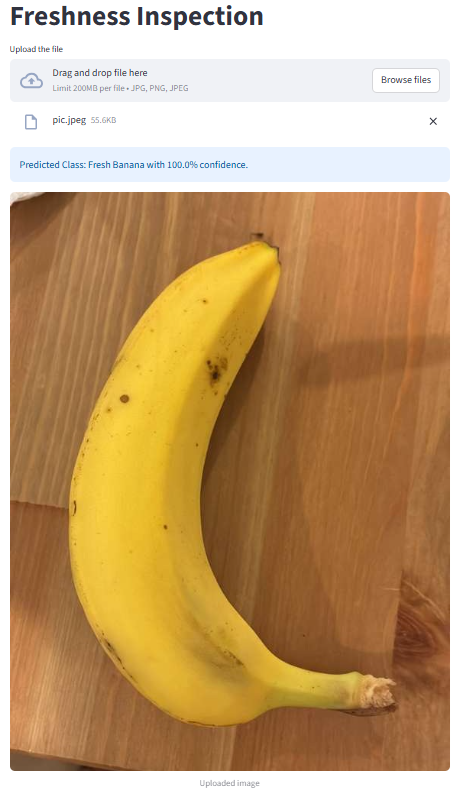
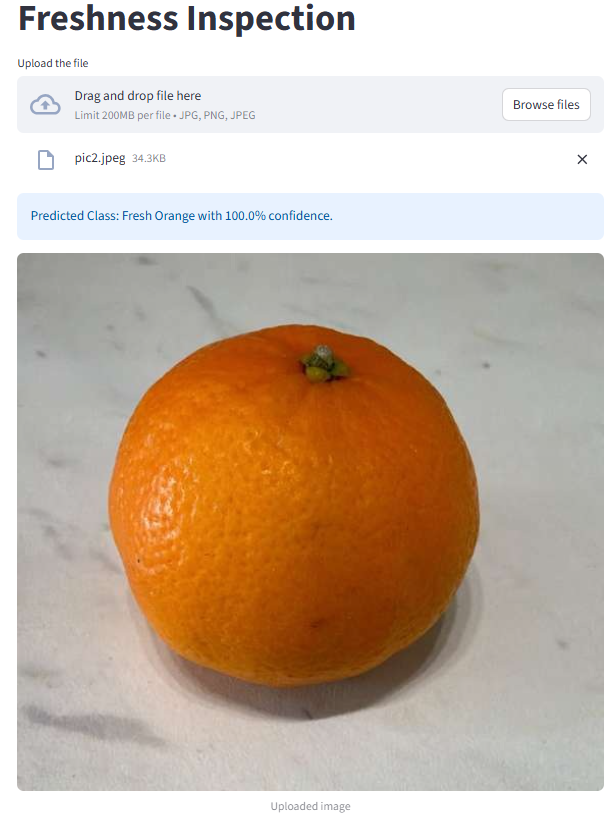

# 🍓 Freshness Inspection App

This project was developed as part of the **Virtual Internship**, the final stage of the **Codebasics Data Science & GenAI Bootcamp**.  
The goal is to build a machine learning–powered system that can **inspect the freshness of fruits** using image classification.

---

## 🏢 Business Context

### About FreshHarvest Logistics

**FreshHarvest Logistics** is a mid-sized company specializing in the warehousing and distribution of fresh fruits and vegetables across California. They supply fresh produce to supermarkets and local farmers' markets, striving to deliver high-quality goods to their customers.

The company handles **8 types of fruits/vegetables**:
- 🍌 Banana
- 🍋 Lemon
- 🥭 Lulo
- 🥭 Mango
- 🍊 Orange
- 🍓 Strawberry
- 🍅 Tamarillo
- 🍅 Tomato

### The Problem

In recent months, FreshHarvest Logistics has faced several critical operational challenges due to **inconsistent manual quality inspections**:

1. **Operational Inefficiency**: Manual inspections are prone to human errors caused by inconsistent lighting conditions and worker fatigue, leading to unreliable quality assessments.

2. **Business Losses**: Increasing refund requests and a declining brand reputation have resulted in significant financial and operational setbacks.

3. **Customer Complaints**: Retailers consistently report receiving spoiled or overripe fruits, particularly strawberries, tomatoes, and mangoes, damaging trust and business relationships.

### The Solution

To address these challenges, FreshHarvest Logistics is implementing an **AI-powered automated freshness inspection system**. 

**System Design**:
- Integration with the warehouse's existing conveyor belt infrastructure
- High-speed cameras positioned to capture images of fruit crates in real-time as they move along the belt
- Deep learning model performing real-time classification to accurately identify fruits as either fresh or spoiled
- Automated sorting and quality control, eliminating human error and improving consistency

This solution ensures **faster, more reliable quality control**, reducing waste, improving customer satisfaction, and protecting the company's reputation.

---

## 🧠 Use Case

This app provides a fast, automated solution to determine whether a fruit is **fresh or spoiled**, supporting better inventory management, waste reduction, and quality assurance in the supply chain.

The system classifies an uploaded image into one of **16 categories**:

| Fresh Classes | Spoiled Classes |
|----------------|----------------|
| F_Banana 🍌 | S_Banana 🍌 |
| F_Lemon 🍋 | S_Lemon 🍋 |
| F_Lulo 🥭 | S_Lulo 🥭 |
| F_Mango 🥭 | S_Mango 🥭 |
| F_Orange 🍊 | S_Orange 🍊 |
| F_Strawberry 🍓 | S_Strawberry 🍓 |
| F_Tamarillo 🍅 | S_Tamarillo 🍅 |
| F_Tomato 🍅 | S_Tomato 🍅 |

---

## 🏗️ Model Development

### ✅ Approach
- Started with several CNN architectures using transfer learning.
- Tested multiple pretrained models including EfficientNet, ConvNeXt, and ResNet.
- Fine-tuned **ResNet50**, which emerged as the **winner model**.

### ⚙️ Key Techniques
- Used **data augmentation** to increase dataset variability (flips, rotations, color adjustments).
- Resized images to **224×224 pixels**.
- Normalized inputs using **ImageNet mean and standard deviation**.
- Trained with **CrossEntropyLoss** and the **Adam optimizer**.

### 📊 Results
- Achieved an impressive **99.8% accuracy** on the test set.  
- Demonstrated exceptional performance distinguishing subtle freshness differences between fruit categories.
- Model is robust enough for real-time deployment on conveyor belt systems.

---

## 🖥️ Streamlit App

A clean and interactive **Streamlit app** allows users to upload a photo of a fruit.  
The system immediately predicts whether it's **fresh** or **spoiled** and shows the confidence level.

This demo application simulates the production system that will be deployed at FreshHarvest's warehouse facilities.

---

## 🖼️ Screenshots

Here's how the app looks in action:




---

## 📁 Project Structure

```
├── streamlit-app/
│   ├── app.py                # Streamlit frontend
│   ├── model/
│   │   └── freshness_model.pth  # Trained ResNet model
│   ├── helper_functions.py   # Prediction helper functions
│   ├── ss1.png               # App screenshot 1
│   ├── ss2.png               # App screenshot 2
│   └── temp_file.jpg         # Temporary uploaded image
├── README.md
└── requirements.txt
```

---

## 🚀 How to Run the App Locally

1. Clone the repository:
   ```bash
   git clone https://github.com/yourusername/freshness-inspection.git
   cd freshness-inspection
   ```

2. Install dependencies:
   ```bash
   pip install -r requirements.txt
   ```

3. Launch the Streamlit app:
   ```bash
   streamlit run app/streamlit_app.py
   ```

---

## 📌 Future Improvements

- Add Grad-CAM visualization to highlight regions influencing the prediction.
- Extend the dataset to more fruit types beyond the current 8 varieties.
- Optimize model inference speed for real-time conveyor belt deployment.
- Develop mobile application for on-the-go quality inspections.
- Deploy the app on Hugging Face Spaces for wider accessibility.
- Integrate with inventory management systems for automated stock control.

---

## 🎯 Business Impact

This AI-powered solution enables FreshHarvest Logistics to:
- ✅ **Reduce operational costs** through automation
- ✅ **Improve accuracy** and consistency in quality control
- ✅ **Minimize waste** by catching spoiled produce earlier
- ✅ **Enhance customer satisfaction** by ensuring only fresh products reach retailers
- ✅ **Protect brand reputation** and reduce refund requests
- ✅ **Scale operations** without proportionally increasing manual inspection staff

---

⭐️ **If you found this project useful, please give it a star!**